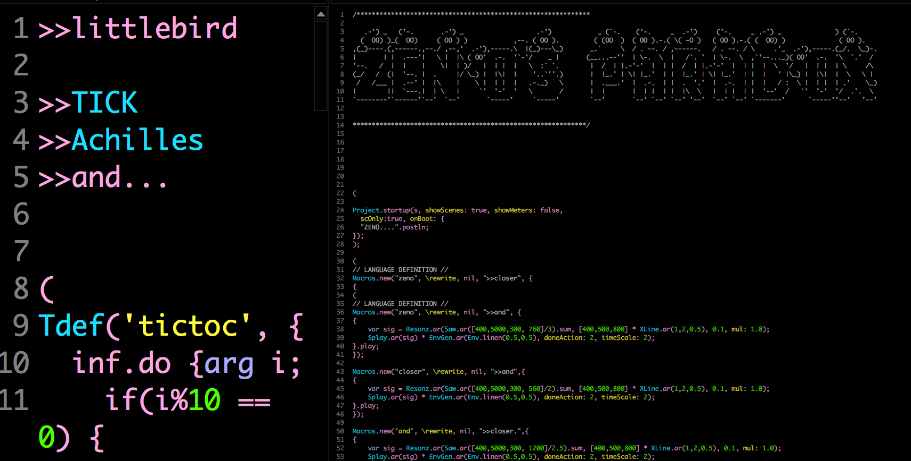

`
Sema is a playground where you can rapid prototype mini-languages for live coding that integrate signal synthesis, machine learning and machine listening. `

[Sema Editor Github Repo](https://github.com/mimic-sussex/eppEditor)

# MIMIC Summer Workshop 2019

Goals.............

<iframe src="https://player.vimeo.com/video/350327092" width="640" height="398" frameborder="0" allow="autoplay; fullscreen" allowfullscreen></iframe>

<a href="https://vimeo.com/350327092">SEMA microlanguage connecting to visuals 2</a> from <a href="https://vimeo.com/jonathanreus">Jonathan Reus</a> on <a href="https://vimeo.com">Vimeo</a>.

### What does the Browser offer?
* an extremely flexible platform ~~ javascript :-X  ~~ HTML ~~ css ~~ that can be molded and modified to one's heart's content

* technology with huge financial and community investment
   * Tensorflow.js, three.js, nearley.js etc... some things that are either difficult or impossible to smoothly integrate into SuperCollider

* known cultural quantity for an audience

* potential for writing -> rewriting text, image and other media

first experiments connecting a SEMA microlanguage to other browser apis (in this case [three.js](https://threejs.org/)) ...

[video 1](https://vimeo.com/350326806)

[video 2](https://vimeo.com/350327092)

### What does this enable me to do?

__Music Composition?__

Seems like the sound synthesis & compositional toolkit in the browser is limited (?not necessarily a terrible thing, but doesn't generalize well)

__Speech and Storytelling__

Continued work in this direction... ?

[Algorithms that Matter (IEM research project)](https://almat.iem.at/questions.html)

[ALMAT Research Iteration](https://www.researchcatalogue.net/view/487048/487049)

__Storytelling__

* WordWeaving / Zeno's Paradoxes

__SEMA & ML__

as an exploration tool ~~~ language-making study/making interventions..
The nearley grammar making is lovely :-)

highly transferrable skills/knowledge (HTML/CSS/Javascript)

heavy resource investment into new/cutting edge apis

sound & visuals via language making are a powerful way of exploring these APIs in an intuitive way

also for meta-language/environments to be able to explore these apis, processes, algorithms anatomically

[Anatomies of Intelligence](https://anatomiesofintelligence.github.io/)

<iframe src="https://player.vimeo.com/video/349275955" width="640" height="394" frameborder="0" allow="autoplay; fullscreen" allowfullscreen></iframe>

<a href="https://vimeo.com/349275955">K-means Clustering (excerpt)</a> from <a href="https://vimeo.com/jonathanreus">Jonathan Reus</a> on <a href="https://vimeo.com">Vimeo</a>.

__barriers to usage in daily artistic work?__

difficulty in bridging datasets & various media with the sandboxed environment of the browser/maximilian/tensorflow (or whatever the ML api du jour is in the future...)

complexity increases dramatically as your desires expand beyond the basic system (epp language + exposed Maximillian API)

the process of making your own language that deviates significantly from the epp language is extremely difficult and limits the artistic exploration of expressive language

styling/expressing/using the language is not easily customized (e.g. see Elina's performance)
